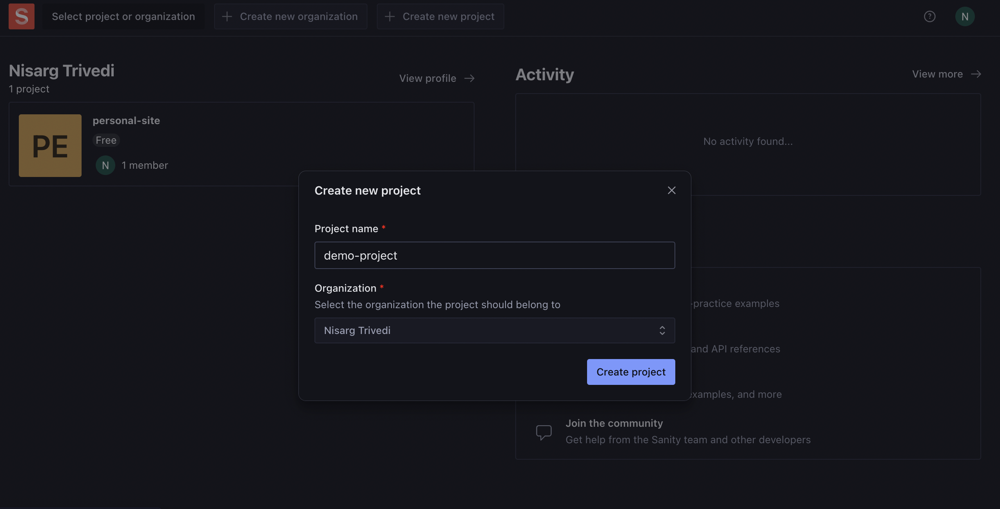
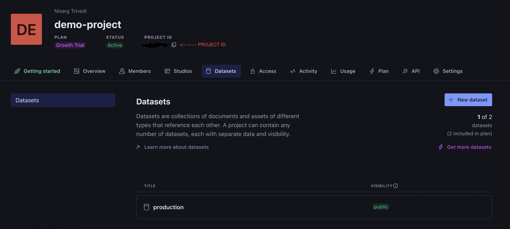

# Sanity Content Studio Installation Guide

This guide will help you set up and run Sanity Content Studio locally. Follow these steps carefully to ensure a successful installation.

## Prerequisites
- Git
- Node Version Manager (nvm)
- Node.js 20.17.0
- npm 10.8.2

## Installation Steps

### 1. Repository Setup
```
# Clone the repository
git clone https://github.com/Nisarg1112/studio-nisarg-digital-diary.git

# Navigate to project directory
cd studio-nisarg-digital-diary
```

### 2. Node.js Setup
```
# Install Node.js using nvm
nvm install 20.17.0

# Verify npm version
npm -v  # Should show 10.8.2
```

### 3. Installl dependencies
```
# Install required dependencies
npm i
```

### 4. Sanity.io Configuration
1. Create an account at Sanity.io
2. Create a new project, refer to the screenshot below



3. Navigate to [Sanity Project Management](https://manage.sanity.io/)
4. Locate your Project ID displayed under the project name (refer below screenshot)




> Note: The default dataset **"production"** will be created automatically

### 5. Launch Content Studio
```
# Create a new `.env` file in the root directory
touch .env

# Add the following environment variables to the .env file (replace with your actual values)
SANITY_STUDIO_PROJECT_ID = "your-project-id"
SANITY_STUDIO_DATASET = "production"

# Start the Sanity Content Studio
npm run dev
```

> Note: You may be prompted to log in to Sanity.io if you haven't already.

After successful installation, Sanity Studio will be available at `http://localhost:3333`

# Sanity Clean Content Studio

Congratulations, you have now installed the Sanity Content Studio, an open-source real-time content editing environment connected to the Sanity backend.

Now you can do the following things:

- [Read “getting started” in the docs](https://www.sanity.io/docs/introduction/getting-started?utm_source=readme)
- [Join the community Slack](https://slack.sanity.io/?utm_source=readme)
- [Extend and build plugins](https://www.sanity.io/docs/content-studio/extending?utm_source=readme)
